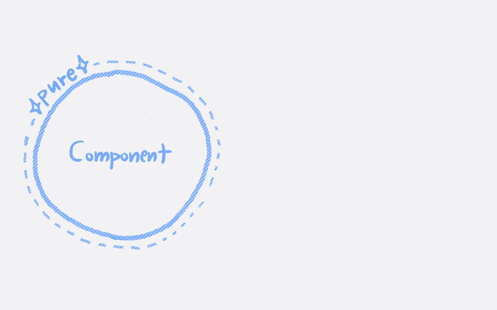

# 01. 컴포넌트 선언하고 사용하기: Component 기본 구조와 JSX

      

## 🎯 요구 사항
- `/templates` 에 있는 html 템플릿을 그대로 `App.jsx`에서 그릴 수 있게 해보세요. 
- `App.jsx`를 여러 개의 컴포넌트로 분리해서 그려보세요.  
  - 스타일도 별도의 css파일로 분리하여 각 컴포넌트에서 import합니다.
  - (선택) `module.css` 를 사용해 보세요.

### 구현 결과 예시
- 예를 들어, `App.jsx`의 return문을 아래와 같이 작성했을 때에 앱이 정상적으로 그려지도록 구현해 주세요. 
- 컴포넌트의 이름이나 구조는 마음대로 변경해도 좋습니다    
```javascript
function App() {
  return (
    <>
      <Header />
      <main>
        <CategoryFilter />
        <RestaurantList />
      </main>
      <aside>
        <RestaurantDetailModal />
        <AddRestaurantModal />
      </aside>
    </>
  );
}
```

## ✅ 키워드
- JSX
  - `class` -> `className`
  - `for` -> `htmlFor`
  - self closing tag
  - Fragment
  - `{}` 내에 쓸 수 있는 JS 식
- React Component
  - 기본 구조
  - export / import

## 🧙‍♀️ 진행 가이드
- 권장 진행 시간: 1시간 내
- 권장 시간 이후에는 요구 사항 별로 아래 브랜치를 참고해 보세요 
  - [guide/01-1](https://github.com/woowacourse/self-paced-react/commit/431d1b7e09e3bd3e4780d0c5666bca2a396906f5) 
  - [guide/01-2](https://github.com/woowacourse/self-paced-react/commit/3bf3e7a1564c750fa55565c184953fb3e2484062)

## 🔗 참고 문서
- [Thinking in React](https://react.dev/learn/thinking-in-react)의 Step1-2 에 있는 것처럼 나만의 컴포넌트 단위를 나누어 보세요.
- [Your First Component](https://react.dev/learn/your-first-component)


### 조금 더 알아보기  
- React Component는 JSX를 리턴하는 순수 함수여야 합니다. 즉, React Component를 여러 번 호출하더라도 항상 동일한 JSX를 리턴해주어야 합니다. 
  - 조금 더 정확히 말하자면 React의 'render' 과정은 항상 순수해야 합니다. 
  - React에서는 이 순수성을 보장하기 위해 [StrictMode에서 Component 함수를 두 번씩 호출하여 검증하기도](https://react.dev/learn/keeping-components-pure#detecting-impure-calculations-with-strict-mode) 합니다. 
  - side effects 없이는 필요한 기능들을 구현하기 어렵죠. render 과정 외에서 side effects를 다루는 방법들은 이후에 차차 소개합니다. 
