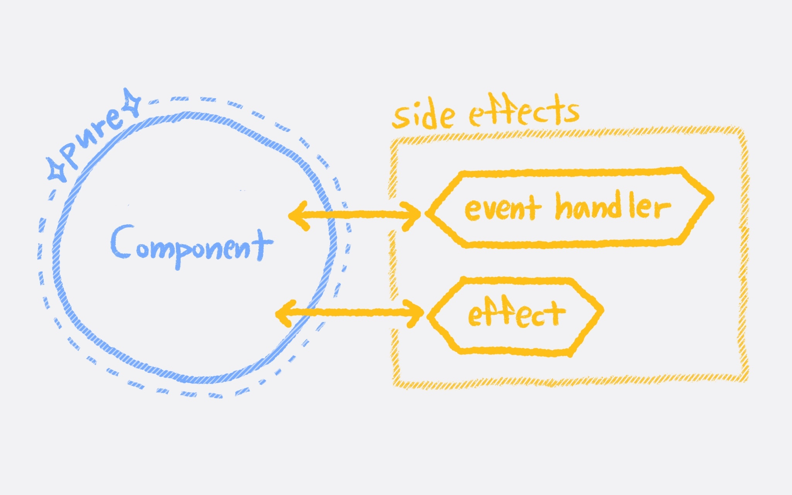

# 05. API 연동하기: side-effect(feat. effects)

    

## 🎯 요구 사항
- API로 레스토랑 목록을 불러와 `<RestaurantList />`에 내려줍니다.
  - 로딩 상태, 에러 상태 등은 고려하지 않습니다.
- 레스토랑 추가 모달에서 추가하기 버튼을 클릭하면 POST 요청을 보냅니다. 모달이 닫히고, 레스토랑 목록을 다시 불러옵니다. 

## ✅ 키워드
- effect (feat. side effect)
  - useEffect

## 🧙‍♀️ 진행 가이드

- 권장 진행 시간: 2시간 내
- 권장 시간 이후에는 요구 사항 별로 아래 브랜치를 참고해 보세요 
  - [guide/05-1](https://github.com/woowacourse/self-paced-react/commit/3f9924feff5e0562f76d91b76f426e9f6b9c63f0) 
  - [guide/05-2](https://github.com/woowacourse/self-paced-react/commit/cfe7eaf5024d0303012e38b832191650beb91cc6)

### `json-server`로 가짜 서버 띄워 활용하기     
연습용 앱이기 때문에 [`json-server`](https://github.com/typicode/json-server)를 활용해 간단한 가짜 REST API를 구축해 사용합니다.         
- `npm run server`를 실행합니다. (혹은 `npx json-server db.json` 를 직접 실행해도 상관없습니다)
- `GET http://localhost:3000/restaurants`으로 `db.json`에 있는 레스토랑 목록을 불러올 수 있습니다.
```javascript
// GET 예시
const response = await fetch("http://localhost:3000/restaurants");

// POST 예시
const response = await fetch("http://localhost:3000/restaurants", {
  method: "POST",
  headers: {
    "Content-Type": "application/json",
  },
  body: JSON.stringify(restaurant),
});
```     

## 🔗 참고 문서
- [Synchronizing with Effects](https://react.dev/learn/synchronizing-with-effects)
> Effects let you specify side effects that are caused by rendering itself, rather than by a particular event.     
  - [API Reference: useEffect](https://react.dev/reference/react/useEffect)
  > useEffect is a React Hook that lets you synchronize a component with an external system. 

구현을 다 해본 뒤에 Introduction에서 살펴보았던 설계 원칙과 관련해 조금 더 학습해보고 싶다면 아래 문서들도 추가로 다시 확인해 보세요.
- [You Might Not Need an Effect](https://react.dev/learn/you-might-not-need-an-effect)
> You do need Effects to synchronize with external systems.  
> In React, data flows from the parent components to their children. 
- [Components and Hooks must be pure](https://react.dev/reference/rules/components-and-hooks-must-be-pure)
> Purity in Components and Hooks is a key rule of React that makes your app predictable, easy to debug, and allows React to automatically optimize your code.
> Side effects should not run in render, as React can render components multiple times to create the best possible user experience.
> One important principle in React is local reasoning: the ability to understand what a component or hook does by looking at its code in isolation. Hooks should be treated like “black boxes” when they are called.
